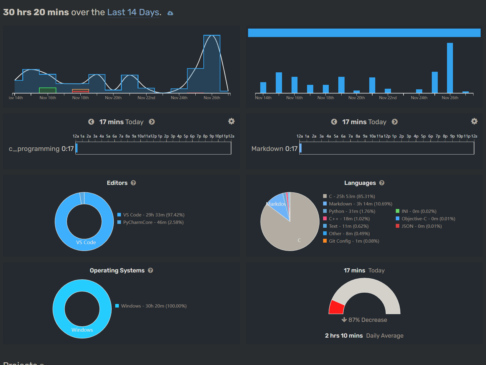

## 一、为什么我当初选择留下?

    1.余轶瑞学姐当初对我评价比较好,当时期望我能够担任此职
    2.大一只参加过两次社团的公益活动(意趣友伴和"六一"公益市集),想要更好的参与到社团公益活动中去,至少参与一次许舍小学讲绘本的活动.
    3.大一我参加了大部分的办公室工作.对办公室的工作流程,对工作内容大致了解,同时由于入社后没有参与"百团大战"的准备工作和招新工作,比较想参加这两次任务
    4.我不想让我的大学生活仅徘徊在"宿舍-食堂-教学楼"这样的三点一线,我也想同人交流,同不同专业的同学交流.
    5.社团在上一届经历了一次低谷,这是在我刚入社团时能够明显看到的.我希望留任能够帮助社团所面临的困境.

## 二、我理想中我负责的办公室部门

- 不得不说,我似乎并不适合这样一个管理层的位置,我本人在某种程度上来说更偏向于任务型驱动,对于发号施令,布置任务方面,难以开口.在任务的安排上做不到那么具体,更多时候我更愿意自己去做.

- 办公室一个枢纽,将整个社团的同学通过一次次的例会、活动、团建组织联系起来,必须要承认的是办公室在去年没有做到很好,以致于很多同学到最后甚至都没能认全一个部门的人.
  上一届的有不少例会包括上半年的年终例会,内容方面我都有策划和参与,所以在上一届营造社团氛围这一方面我也有责任.办公室需要拿出更加吸引人的例会或者活动,来让大家参与,带动社团的气氛.

- 结合上一届在办公室的经历看来,氛围总是由少部分的人带动起来的.尤其是领头或者说部长能够带动这样一个氛围.我还记得第一次办公室团建,是去了一家东北菜馆,大家互相认识了一下,饭桌上也聊的很开心,那一次,但是随着时间的推进,每个人熟悉了校园生活后,积极度是有所下降的.或者说是社团没有达到每个人的心理预期,以致于后来余姐后来带我们一起玩的时候大一的同学都不来,甚至例会都无缘无故退出的情况.认为作为部长,最好能够起到活跃社团的作用,至少能够协调出时间和社团成员或者部门成员一起娱乐.

- 在调动氛围和积极性方面,效果最好的就是能够聚在一起出去玩,其次游戏也不失为一个较好的社交媒介

## 三、我在团队中所扮演的角色和承担的责任

    1.作为学长,可能有必要对学弟学妹提出的学习或校园生活的疑问给出必要的解答
    2.身为办公室部长,由于办公室任务量相对较小,对任务的安排要具体明确,最好精确到某一位同学,让办公室在任务量较小的情况下,每个同学仍有参与度.
    3.作为三个职能部门之一的部长,应更好的了解其他各个部门任务,我觉得办公室有一定的监督作用.
    4.最重要是的调动成员积极性和营造更好的氛围.负责举办更好的活动,设计新颖的例会形式,能够尽可能的让大家参与度提高.

## 四、关于我社团离职或者降级处理的请求

- 第一个是确实是学业上比较忙碌了,计算机数据结构无论是代码实现方面还是算法理解与应用方面和我上学期的课程相比难度上升过大.目前没有考研的打算,所以偏向于找工作和积累项目经验.对于专业课的学习打算投入更多的精力

- 第二是我参加了服务外包项目,所作的项目较为庞大(和四位研究生学长学姐组队,参与视频图像分割项目),可能对社团工作不能那么上心或者说关注了
  下面为最近工作统计
  .

- 第三个方面是我个人认为,我现阶段并不适合这种管理层的位置,作为管理者需要付出太多精力关注消息和工作,而我本人更愿意经过思量和考虑之后在给予消息回复,在及时性方面不能保证,导致工作效率会下降.

- 办公室承担中转方面的任务颇多,需要较多打理人际关系,再加上我本人对于发言的谨慎和较多考量,在此方面浪费精力较多,我希望够将更少的精力放在打理人际上,从而更好的完成我的专业课程学习和服务外包项目上.

- 坦白的讲,现在我对于公益的热情没有上个学期或者刚加入社团时那么强烈了,我想这其中既有我参与社团活动少的缘故,也有专业课程压力的缘故,

- **以上是我对目前自己所处状况的分析,我将负责办公室部长的职位至本次团建结束,以此做出我对社团的最后一份贡献.**

- **最后希望"阳光部落"能够延续"心灵放牧人的"理念,能够在公益的路上走的更长更远.**
  能如太阳一样,留住更多热心于公益的同学
  
